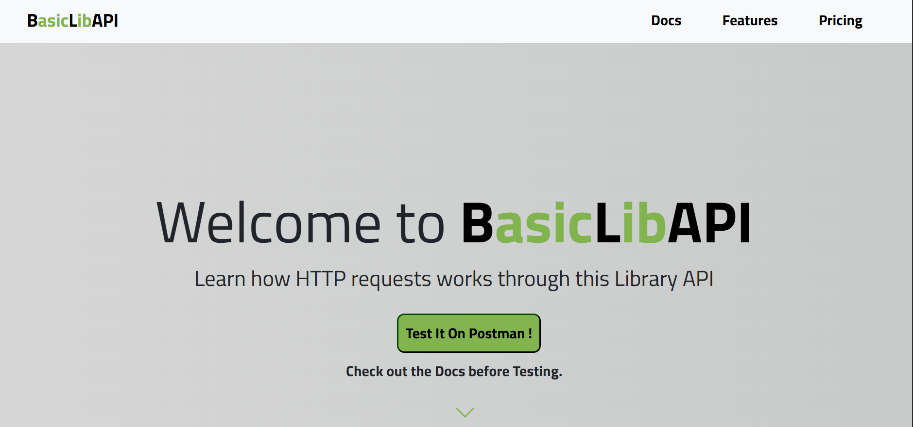

# **BasicLibAPI**

Presenting BasicLibAPI,an REST API through which you can learn how to use HTTP Requests.
Learn HTTP Requests like you are interacting with books in the library.

Check out the Docs Section of the BasicLibAPI before testing it on Postman.

## Features:
- Performs CRUD Operations
- HTTP Requests like GET,POST,PUT,DELETE

[image]

## Tech Stack:
- Python 3
- Flask
- SQLAlchemy
- Docker
- Bootstrap

